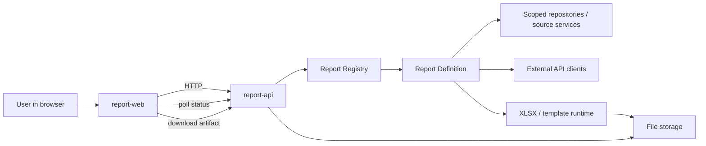
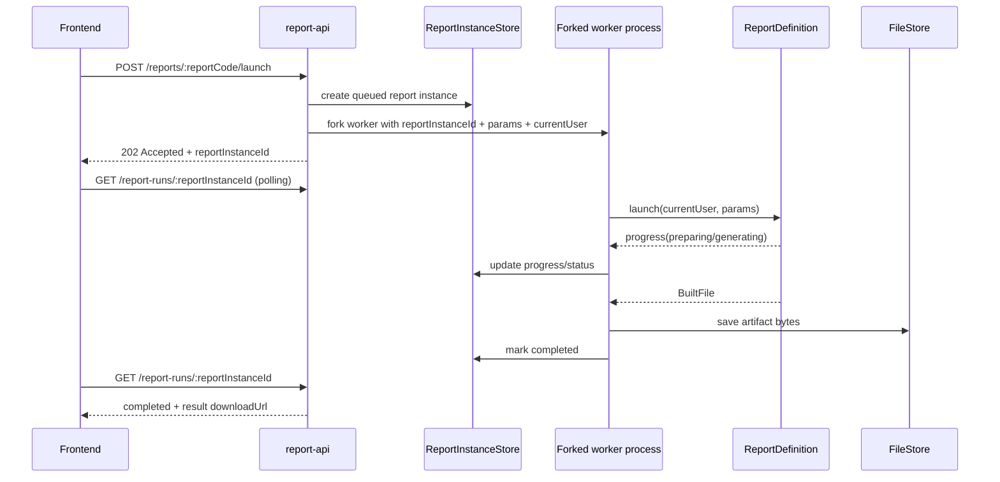

# ARCHITECTURE.md

## 1. Purpose and scope

This repository contains a **prototype Report Platform**: a system where new reports can be added quickly, launched asynchronously, monitored from the UI, and downloaded as generated artifacts.

The implementation is intentionally prototype-oriented:

- the architecture is designed to show a **repeatable pattern** for adding reports;
- the platform already supports **multiple report definitions** and **multiple output files**;
- generation is **asynchronous** and visible to the user as a report run with status/progress;
- some infrastructure and storage choices are simplified to keep the prototype small and inspectable.

This document describes the architecture **as implemented in code now**, even where older docs in the repository still reflect an earlier `jobId`-based flow.

---

## 2. High-level system view

### Main building blocks

1. **Frontend (`apps/report-web`)**
   - React + Vite + Redux Toolkit + RTK Query + React Router
   - Step-based UI:
     - report selection
     - launch configuration
     - run progress
     - result
   - The route is used as the primary runtime state for the active run:
     - `/report-launch`
     - `/report-launch/configure`
     - `/report-runs/:reportInstanceId`
     - `/report-runs/:reportInstanceId/result`

2. **Backend API (`apps/report-api`)**
   - NestJS HTTP API
   - exposes:
     - report catalog
     - report metadata
     - shared settings lookup for external services
     - tenant/organization options
     - async launch endpoint
     - run status endpoint
     - history endpoint
     - artifact download endpoint

3. **Report platform libraries (`libs/report-platform/*`)**
   - contracts
   - auth/current-user resolution
   - scoped data-access mocks
   - external API client factory
   - registry
   - XLSX/template runtime
   - file storage

4. **Report definitions (`libs/report-definitions/*`)**
   - each report lives in its own module
   - owns:
     - input schema
     - metadata
     - source assembly
     - report service / file build logic
     - template assets if needed

5. **Artifact and run storage**
   - filesystem-backed storage
   - per run:
     - metadata JSON
     - artifact bytes

6. **Docker environment**
   - `docker-compose.dev.yml`
   - `docker-compose.preview.yml`
   - API + web + Redis are started together
   - Redis is present as an infrastructure placeholder for future queue evolution

---

## 3. Monorepo structure

```text
apps/
  report-api/        # NestJS backend
  report-web/        # React frontend

libs/
  report-definitions/
    simple-sales-summary/
    simple-sales-summary-xlsx/
  report-platform/
    api-client/
    auth/
    contracts/
    data-access/
    external-api/
    file-store/
    registry/
    xlsx/

docs/
  how-to-add-report.md
  reporting-architecture.md
  external-dependency-resilience.md
```

### Responsibility split

- **apps/** contain runtime applications
- **libs/report-platform/** contains platform-level reusable mechanisms
- **libs/report-definitions/** contains report-specific business logic
- **docs/** explains intended extension patterns and design rationale

This separation is important: the platform should grow by adding new report modules, not by bloating API controllers or frontend pages with report-specific logic.

---

## 4. Runtime architecture and data flow

## 4.1 End-to-end flow



## 4.2 Launch flow



## 4.3 Why this flow matters

This flow is the core of the prototype:

- the user gets a **stable run ID immediately**;
- generation continues **outside the request-response lifetime**;
- UI can recover state by URL alone;
- the final artifact is treated as a stored result, not as a synchronous controller response.

That makes the platform ready for future migration from local forked processes to a real queue/worker architecture without changing the frontend contract much.

---

## 5. Backend architecture

## 5.1 API layer

### Main controllers

#### `ReportsController`

Responsible for:

- listing available reports
- returning report metadata
- resolving shared settings for report external dependencies
- returning tenant/organization options
- launching report generation
- listing historical instances for a report
- returning generated file bytes

### `ReportRunsController`

Responsible for:

- returning the current state of a single report run by `reportInstanceId`

### `HealthController`

Responsible for:

- basic health check

---

## 5.2 Report instance model

The backend runtime revolves around a **report instance**.

A report instance represents one concrete launch attempt and contains:

- `id`
- `reportCode`
- `status`
  - `queued`
  - `running`
  - `completed`
  - `failed`
- `stage`
  - `queued`
  - `preparing`
  - `generating`
  - `storing-result`
  - `done`
  - `failed`
- `progressPercent`
- timestamps
- result metadata
- artifact metadata
- optional error message

### Why this model is useful

It gives the platform:

- a stable asynchronous boundary
- a UI-friendly progress model
- history for a given report code
- a place to attach artifacts and failures

---

## 5.3 Asynchronous execution model

The current prototype uses a **forked Node worker process** per launch.

### Current flow

1. API validates request and access
2. API creates a queued report instance
3. API forks a worker process
4. Worker reconstructs a registry and executes the report
5. Worker sends IPC events:
   - progress
   - completed-built-file
   - failed
6. API-side runner persists status updates and artifact storage result

### Why this is a good prototype choice

Pros:

- easy to inspect
- simple mental model
- keeps long-running work out of request handlers
- no hard dependency on external queue infrastructure
- enough to demonstrate async generation properly

Trade-off:

- not horizontally scalable as-is
- not resilient enough for true production workloads
- not ideal for high concurrency

This is acceptable for the prototype and intentionally keeps the architecture legible.

---

## 5.4 Registry-based report execution

The platform executes reports through a **registry**.

A report definition exposes a uniform shape:

- `code`
- `title`
- `description`
- `getMetadata()`
- `launch(currentUser, params, options?)`

The registry:

- stores report definitions
- prevents duplicate codes
- lists reports
- returns metadata
- returns a report implementation by code

### Why registry is the core extension point

Without a registry, controllers would need hardcoded branching per report.  
With the registry, the platform can remain generic while report-specific logic stays inside each report package.

This is one of the most important architectural choices in the repository.

---

## 5.5 Storage model

### Report instance metadata

Stored on filesystem as JSON.

### Artifact bytes

Stored on filesystem as binary file.

### Per-run layout

Conceptually:

```text
{GENERATED_REPORTS_DIR}/{reportCode}/{reportInstanceId}/
  meta.json
  artifact.bin
```

### Why filesystem storage was chosen

For the prototype:

- trivial to inspect
- easy to persist in Docker volume
- no DB schema needed
- simple to debug by hand

Trade-off:

- not suitable for real distributed production
- poor fit for advanced search/filtering/report history analytics
- artifact serving is limited compared to object storage/CDN

---

## 6. Frontend architecture

## 6.1 UI structure

The frontend is intentionally split into:

- **routing shell**
- **container/runtime layer**
- **presentational story components**

This keeps UI rendering separate from platform orchestration logic.

### Route-driven flow

The UI uses URL as the main source of truth:

- step 1: select report
- step 2: configure inputs
- step 3: observe run progress by `reportInstanceId`
- step 4: view completed result

This is stronger than storing everything only in component state:

- a page refresh does not destroy the active run context
- a direct URL open can recover run status
- users can share/debug specific run URLs

---

## 6.2 Frontend state responsibilities

### Redux session slice

Stores selected mock user.

### Redux launcher slice

Stores launch draft:

- selected report
- selected tenant
- selected organization
- credentials mode
- manual API key / shared setting
- parameter values
- launch snapshot

### RTK Query

Owns server communication and caching for:

- report list
- report metadata
- tenants
- organizations
- shared settings
- launch mutation
- run status
- history
- download URLs

### Container/hooks layer

Builds metadata-driven UI behavior:

- auto-select defaults
- enforce route preconditions
- construct launch payload
- compute disabled states and access messages
- redirect between progress/result states

---

## 6.3 Why the frontend is metadata-driven

The platform does **not** hardcode every report form in the frontend.

Instead, the frontend reads report metadata and derives:

- required fields
- field kind (`tenant`, `organization`, `text`)
- source (`select`, `user-context`, `input`)
- external dependency information
- minimal role to launch

Benefits:

- the UI remains mostly generic
- new reports can reuse the existing launch flow
- platform behavior is easier to standardize

Trade-off:

- very complex report UIs may eventually outgrow purely metadata-driven forms
- some report-specific frontend extension point may be needed later

For this prototype, the balance is correct.

---

## 7. Platform boundaries and responsibility lines

## 7.1 What belongs to the platform

The platform owns:

- report discovery
- launch contract
- async run lifecycle
- run status model
- artifact storage and download
- current-user resolution
- access checks
- shared-settings lookup
- generic frontend flow
- template runtime
- reusable data access abstractions
- external client factory

## 7.2 What belongs to an individual report

A report owns:

- its code and metadata
- its input schema
- its source assembly logic
- external dependency usage specific to that report
- template files
- mapping from raw data to output structure
- output file naming/content rules

## 7.3 Why this boundary is important

If report logic leaks into the platform layer:

- each new report requires touching controllers and global code
- platform complexity grows linearly
- extension speed drops

If platform concerns leak into each report:

- access control becomes inconsistent
- status handling is duplicated
- async lifecycle breaks apart

The current structure generally keeps these responsibilities well separated.

---

## 8. Security and access model

The prototype uses mock users, but the access model is already architectural, not accidental.

### Roles

- `Admin`
- `TenantAdmin`
- `Member`
- `Auditor`

### Access enforcement ideas already present

1. **Report launch authorization**
   - checked against `minRoleToLaunch`

2. **Repository-level tenant scoping**
   - repositories enforce allowed tenant access

3. **External client creation through factory**
   - reports do not instantiate arbitrary clients directly
   - external client access is checked against report metadata and credential mode

4. **Shared settings are resolved by provider**
   - report receives usable client behavior, not shared settings internals

### Important architectural principle

Reports should not be handed raw database credentials or uncontrolled infrastructure primitives.  
They should operate through platform-approved repositories and factories.

That principle is more important than the current mock implementation detail.

---

## 9. Existing report implementations

At the moment the repository demonstrates the pattern using **two reports**.

## 9.1 `simple-sales-summary`

Purpose:

- create a summary XLSX report with:
  - tenant
  - organization
  - current sales
  - current air temperature

Interesting architectural aspects:

- uses internal repositories
- uses an external weather service
- supports explicit credentials:
  - manual API key
  - shared setting
- treats weather as an **optional dependency** with resilience behavior and fallback marker
- fills an XLSX template and returns a generated file

## 9.2 `simple-sales-summary-xlsx`

Purpose:

- create a product × channel matrix XLSX report

Interesting architectural aspects:

- uses dataset rotation to show multiple result sets over repeated runs
- fills template input sheets
- relies on spreadsheet formulas owned by the template
- recalculates through LibreOffice
- reads computed results back after recalculation
- demonstrates a stronger “template as executable report logic” style

### Why these two reports are a good pair

Together they show two different extension patterns:

1. **API-enriched summary report**
2. **Template/formula-heavy matrix report**

That is enough to demonstrate that the platform pattern is real, not accidental.

---

## 10. XLSX generation architecture

The prototype already leans into XLSX as a first-class output mechanism.

### Current XLSX pipeline

1. report gathers source data
2. report service loads template file
3. template workbook is filled with current data
4. workbook is saved to temporary folder
5. LibreOffice recalculates formulas headlessly
6. optional post-recalc data can be read back
7. final bytes are returned as `BuiltFile`

### Why this approach was chosen

Compared to “generate XLSX from scratch in JS objects only”:

- it preserves business-authored formulas in a real spreadsheet
- it lets spreadsheet layout and derived calculations live in the template
- it is closer to how many real reporting teams work

Trade-offs:

- requires LibreOffice runtime
- more moving parts than pure JSON/CSV generation
- template discipline becomes important

Still, for an XLSX-heavy reporting platform, this is a strong prototype choice.

---

## 11. External dependency handling

The repository includes a dedicated note on resilience, and the code reflects the beginning of that model.

### Current idea

An external dependency can be:

- critical
- optional

For optional dependencies:

- retry policy can be applied
- fallback value can be used
- report may still succeed with visible degradation

### Example in current code

Weather retrieval in `simple-sales-summary` is wrapped as an optional operation with retry strategy and fallback marker.

### Why this matters

A report platform should not treat every external API failure the same way.

Some failures should:

- fail the report

Others should:

- degrade the report
- keep the generation successful
- make the degradation explicit

That distinction is already architecturally useful in the prototype.

---

## 12. API surface

The key backend endpoints are:

### Catalog and metadata

- `GET /reports`
- `GET /reports/:code/metadata`

### Context/configuration

- `GET /reports/:reportCode/external-services/:serviceKey/shared-settings`
- `GET /tenants`
- `GET /tenants/:tenantId/organizations`

### Launch and monitoring

- `POST /reports/:reportCode/launch`
- `GET /report-runs/:reportInstanceId`
- `GET /reports/:reportCode/instances`

### Artifact retrieval

- `GET /generated-files/:fileId`

### Health

- `GET /health`

This API is sufficient for the current frontend and demonstrates the platform contract clearly.

---

## 13. How to add a new report

This is the most important developer workflow in the system.

## Step 1. Create a new report module

Add a new folder under:

```text
libs/report-definitions/<new-report-code>/
```

Recommended internal structure:

```text
src/
  <new-report>.contract.ts
  <new-report>.definition.ts
  <new-report>.source.ts
  <new-report>.service.ts
  <new-report>.template.ts   # if template-based
template-assets/
  ...
```

What goes where:

- `contract.ts` — input/output schemas and small constants
- `definition.ts` — report registration entry point, metadata, orchestration
- `source.ts` — source assembly from repositories / external APIs
- `service.ts` — file-building logic
- `template.ts` — XLSX sheet filling helpers if applicable

---

## Step 2. Define the input schema

Use Zod for report params.

Example responsibilities:

- tenant ID
- organization ID
- text parameters
- external credential mode if the report needs an external service

Why:

- launch validation becomes uniform
- frontend and backend contracts stay explicit
- bad input is rejected early

---

## Step 3. Define report metadata

Implement `getMetadata()` in the report definition.

Metadata should describe:

- `minRoleToLaunch`
- fields
- field kinds
- field source
- external dependencies

This is what makes the frontend configuration step generic.

Rule of thumb:

- if the frontend must know it before launch, it should probably live in report metadata

---

## Step 4. Implement source assembly

Create a source service that gathers the data needed by the report.

Use:

- platform repositories for internal data
- external client factory for external APIs

Do **not** make controllers or frontend compose report data.

The source service should produce a clean report-specific source object.

That keeps report logic testable and keeps the platform generic.

---

## Step 5. Implement output generation

If the report is template-based:

- place template files under `template-assets/`
- fill workbook using the XLSX runtime helpers
- return `BuiltFile`

If the report is not template-based:

- still return `BuiltFile`
- the platform currently expects a file artifact result

The report service is the right place to decide:

- file name
- MIME type
- bytes

---

## Step 6. Register the report in the registry factory

Wire the new report in:

```text
apps/report-api/src/report-registry.factory.ts
```

Pass only the dependencies actually needed by that report.

This is the moment when the report becomes visible to:

- report catalog
- metadata endpoint
- launch execution flow

---

## Step 7. Reuse the generic frontend flow

If your metadata uses supported field types, the report should appear automatically in the existing launch UI.

Validate:

1. it appears in `/reports`
2. metadata is correct
3. step 2 shows expected controls
4. launch succeeds
5. progress page works
6. result page displays final artifact

If the report needs a richer custom UI later, that can be added as an extension point, but do not start there unless necessary.

---

## Step 8. Add tests

At minimum, add:

- input schema tests
- source assembly tests
- report service tests
- happy-path launch integration test

For external APIs:

- prefer contract/mocked client tests over real network dependence

---

## 14. Key decisions and alternatives

Below are the most important design choices in the current implementation.

## Decision 1. Registry-based report model

### Chosen

Uniform `ReportDefinition` objects registered in a central registry.

### Alternatives considered

- hardcoded `switch(reportCode)` in controller/service
- one controller per report
- dynamic plugin loading from filesystem at runtime

### Why current choice won

- explicit and simple
- type-safe enough for a prototype
- easy to test
- keeps platform generic
- new reports are easy to add

### Trade-off

- still requires central wiring in the registry factory
- not yet true plugin discovery

---

## Decision 2. Async execution via forked worker process

### Chosen

Spawn a worker process per launch.

### Alternatives considered

- synchronous generation inside HTTP request
- in-process background promise/task
- BullMQ / Redis queue from day one

### Why current choice won

- proves asynchronous architecture immediately
- easy to understand
- avoids blocking HTTP lifecycle
- much lighter than introducing full queue orchestration too early

### Trade-off

- weaker observability and resilience than a real queue
- limited scalability
- process management is simplistic

---

## Decision 3. Filesystem storage for runs and artifacts

### Chosen

Store run metadata and artifact bytes on local filesystem.

### Alternatives considered

- relational DB + object storage
- relational DB only with blobs
- Redis-only transient storage

### Why current choice won

- minimal setup
- easy local inspection
- easy Docker persistence
- enough for prototype history/download flow

### Trade-off

- not production-grade
- poor cross-instance coordination
- weak querying capabilities

---

## Decision 4. Metadata-driven frontend configuration

### Chosen

Frontend configuration UI is mostly generated from backend report metadata.

### Alternatives considered

- hardcoded React form for each report
- fully schema-driven generic form engine
- report-specific frontend plugins from day one

### Why current choice won

- strong reuse with reasonable simplicity
- keeps UX coherent across reports
- avoids massive frontend branching
- enough flexibility for current field set

### Trade-off

- not all future report UIs will fit
- may need custom field/component extension points later

---

## Decision 5. Template-first XLSX generation with LibreOffice recalculation

### Chosen

Use real XLSX templates, fill them, and recalculate through LibreOffice.

### Alternatives considered

- pure JS XLSX generation from scratch
- CSV export only
- server-side HTML-to-file conversion

### Why current choice won

- realistic for spreadsheet-heavy business reporting
- preserves formulas in templates
- allows non-code spreadsheet logic to remain in the workbook
- demonstrates a reusable report template pattern

### Trade-off

- requires office runtime
- more operational complexity
- debugging bad templates is a separate concern

---

## Decision 6. Repository/factory boundaries instead of raw infrastructure in reports

### Chosen

Reports consume scoped repositories and external client factories.

### Alternatives considered

- give reports raw DB clients
- let each report construct its own external clients directly
- put all data gathering in controllers

### Why current choice won

- access control stays centralized
- report code stays smaller and safer
- external dependency handling becomes standardizable
- easier future replacement of mocks with real implementations

### Trade-off

- more platform abstractions to maintain
- some simple reports may feel “over-structured”

---

## 15. What was intentionally not done

This prototype is deliberately narrower than a production system.

### Not implemented fully

1. **Real persistent database for run metadata**
   - filesystem is used instead

2. **Real queue/worker system**
   - worker processes are forked directly

3. **Authentication/authorization integration**
   - mock users via header are used

4. **Production-grade shared settings management**
   - mock provider exists
   - current hardcoded secret examples are acceptable only as prototype scaffolding

5. **Robust artifact storage**
   - no S3/GCS/MinIO abstraction yet

6. **Advanced observability**
   - no tracing, metrics, structured audit, or job dashboard

7. **Cancellation, retry, re-run semantics**
   - not yet modeled as first-class operations

8. **Report versioning**
   - not yet modeled
   - historical runs do not explicitly track definition version/template checksum

9. **Multi-format abstraction beyond built file**
   - current platform is already file-oriented
   - but not yet generalized for richer output pipelines like PDF with infographic assets

10. **Strong automated test matrix**

- architecture is testable, but the platform still needs fuller coverage

---

## 16. What should be added for production

If this prototype were to evolve into production, I would add the following in roughly this order.

## 16.1 Infrastructure and runtime

- move async execution to BullMQ / Redis or another real queue
- separate API and worker deployment units
- add dead-letter handling and retry policies
- add cancellation and timeout policy per report

## 16.2 Storage

- move run metadata to PostgreSQL
- move artifacts to object storage
- store artifact metadata and retention policy explicitly
- add cleanup/retention jobs

## 16.3 Security

- replace mock users with real auth
- derive user scope from identity provider
- move shared settings to encrypted secure storage
- remove any secret-like values from codebase

## 16.4 Observability

- structured logs with correlation by `reportInstanceId`
- metrics:
  - queue time
  - execution time
  - failure rate
  - external dependency degradation rate
- tracing across API → worker → external service
- audit trail for launches/downloads

## 16.5 Product behavior

- retries / duplicate detection / re-run from previous params
- better history browsing and filtering
- richer run timeline in UI
- partial warnings on degraded reports
- report version visibility

## 16.6 Developer experience

- report generator/scaffolding CLI
- contract test kit for new reports
- template validation utilities
- local fixture packs for report sources
- stronger architecture linting to keep report code inside intended boundaries

---

## 17. Main strengths of the current solution

The current implementation already demonstrates several strong ideas:

1. **Adding a new report is a real pattern, not a one-off hack**
2. **Async generation is modeled correctly around a persistent run ID**
3. **Platform code and report code are separated**
4. **Frontend is generic enough to support multiple reports**
5. **XLSX template strategy is realistic for reporting systems**
6. **Access control and external dependency handling are designed as platform concerns**
7. **The architecture can evolve toward production without throwing away the core contracts**

---

## 18. Final assessment

This repository is best understood as a **platform prototype with a credible growth path**.

It is not production-ready by design, but it already proves the most important architectural points:

- reports can be added as isolated modules;
- launches are asynchronous and user-visible;
- results are persisted and downloadable;
- the frontend can drive multiple reports through shared contracts;
- platform concerns are separated from report-specific logic.

That is exactly the right scope for this assignment: **think broadly, implement narrowly, but make the direction obvious**.
